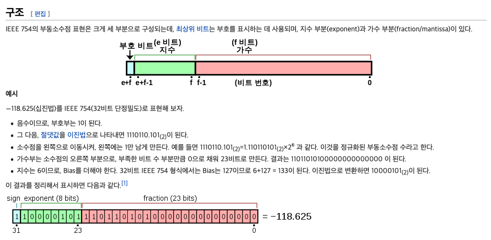

# 가비지 컬렉션

객체 생성 되었을 때 자동으로 메모리 할당.
쓸모 없어졌을 때 자동으로 해제. (가비지 컬렉터가 주기적으로 체크/해제.)

```js
var a = 1; // 정수를 담기 위한 메모리 할당
var b = {c: 2} // 오브젝트와 그 오브젝트에 포함된 값들을 담기 위한 메모리 할당
```

## 해제 대상

닿을 수 없는 오브젝트

```js
var x = {
    a: 2;
}

var y = x;

x = 1;

var z = y.a;

y = 'yo';

z = null;

// 맨 처음 x가 참조했던 오브젝트를 참조하는 곳이 없어짐. 가비지 컬렉팅 대상.
```

## 결론

다 사용하고 나면 닿을 수 없게 만들어주자. (가비지 컬렉팅 대상으로)

[MDN 자바스크립트의 메모리관리](https://developer.mozilla.org/ko/docs/Web/JavaScript/Memory_Management)

# DOCTYPE 선언

브라우저가 문서를 렌더링할 때 제대로 해석하도록 명시.
(호환 모드로 바뀌지 않도록 하는 것이 유일한 목적이다.)


```html
<!DOCTYPE html>
<html>
</html>
```

## 호환 모드와 표준 모드

호환 모드는 예전 방식으로 제작 된 사이트를 렌더링하기 위한 모드.


# Number 오차

컴퓨터에서 부동소수점을 표현하는데 IEEE 754 표준을 사용한다.
이 방식에는 반올림 오차가 존재한다.

```js
console.log(0.1 + 0.2); // 0.30000000000000004
```


이렇다고 한다...

[wiki IEEE 754](https://ko.wikipedia.org/wiki/IEEE_754)

그래도 계산상의 효율성을 위해 쓴다.

[floating-point-gui.de](https://floating-point-gui.de/basic/)

## 결론

이렇다는 걸 알고 [toFixed](https://developer.mozilla.org/ko/docs/Web/JavaScript/Reference/Global_Objects/Number/toFixed), [Math.round](https://developer.mozilla.org/ko/docs/Web/JavaScript/Reference/Global_Objects/Math/round) 등 상황에 맞게 쓰자.

```js
console.log((0.1 + 0.2).toFixed(1)); // 0.3
```
