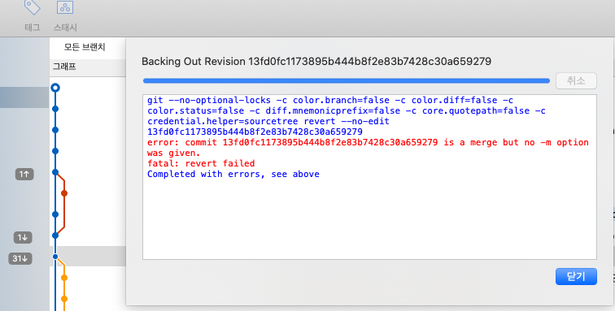

거창한 거 절대 아니고.. 그냥 사소한 실제 깃 사용 후기.

## 사용기

여러 사람과 협업을 하며 개발 코드와 배포 버전 코드의 분리가 힘들었다.

개발 브랜치(develop)를 다 같이 사용하고, 여러 기능을 동시에 개발 진행 한다.
거기서 일부 건만 상용 배포해야하는 경우들이 생긴다.
~~커밋 한개 한개 revert를 한적도~~


검색해보니 이런 저런 복잡한 [브랜치 전략 이론](https://lucamezzalira.com/2014/03/10/git-flow-vs-github-flow/)이 많이 있는데, 지금은 그렇게까지 하기 싫어서
간단한 규칙만 만들었다.

- master: 상용 버전 브랜치
- develop: 상용 배포 준비 브랜치. 즉 기능 별 작업이 완료 된 후 여기 머지한다.
- feature/{feature-name}: 기능 별 브랜치. 작업 완료 후 develop에 머지 후 제거한다.


## 문제 만남

A기능을 완료한 후, 배포 준비가 됐다고 판단. develop 브랜치에 머지했다.
근데, 나중에 보니까 내가 잘못 생각한 부분이 있었다. 
그래서 배포 준비 브랜치에서 해당 기능만 되돌려서 빼야했다.
그냥 단순히 생각했을 때, 머지를 한 커밋도 하나의 커밋이니, 그 머지 커밋을 revert 하면 될 줄 알았다..
근데 아니었다.



병합 커밋은 되돌릴 때, 그 돌아갈 대상이 모호하기 때문에 명확히 지정해줘야 하는 것 같다.

```zsh
git revert -m 1 [commit id]
```
-m 1 옵션은 부모가 보호되어야 하는 “mainline” 이라는 것을 나타낸다.

develop 브랜치에 A기능을 뺀 새로운 커밋이 추가 되었다. 되돌리기 성공. 근데..

### 또 다른 문제 만남
다시 feature/featureA 로 돌아가 맞게 수정을 한 후,
다시 develop 브랜치에 머지를 하니, 위 되돌린 내용으로(A기능을 뺀 상태) 병합되었다.

#### 해결
'A기능을 뺀 커밋' 을 다시 revert 하면 됨..
