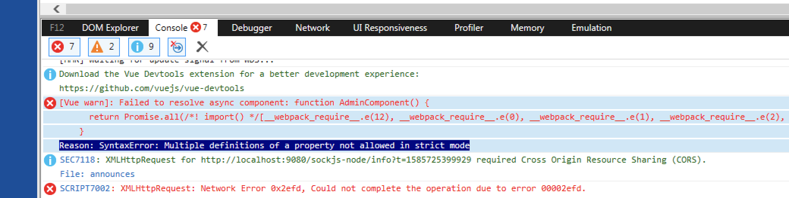

## 에러 만남



에러 메시지와 함께 화면을 아예 그리질 않음.

## 원인

### Multiple definitions of a property not allowed in strict mode

다른 브라우저에서는 중복 속성이 있으면 무시하는데, ie11에서는 허용 자체를 안함.

잘못된 중복 속성 사용 예제)
```html
<input 
    type="checkbox" 
    id="checkbox" 
    v-model="checked"
    :checked="checked"
/>
```

## 교훈

위와 같은 에러 메시지를 만났을 때는 중복 속성 정의를 의심해본다.
