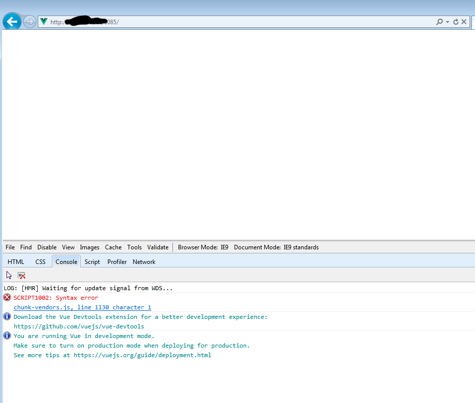
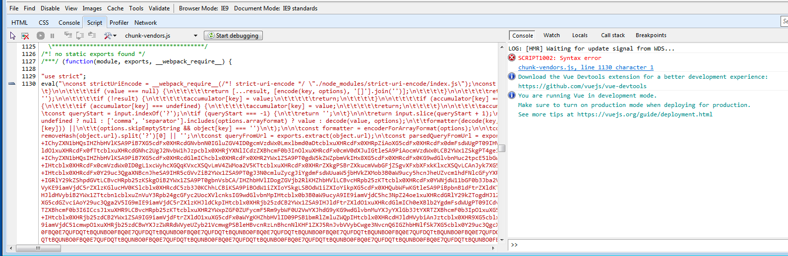
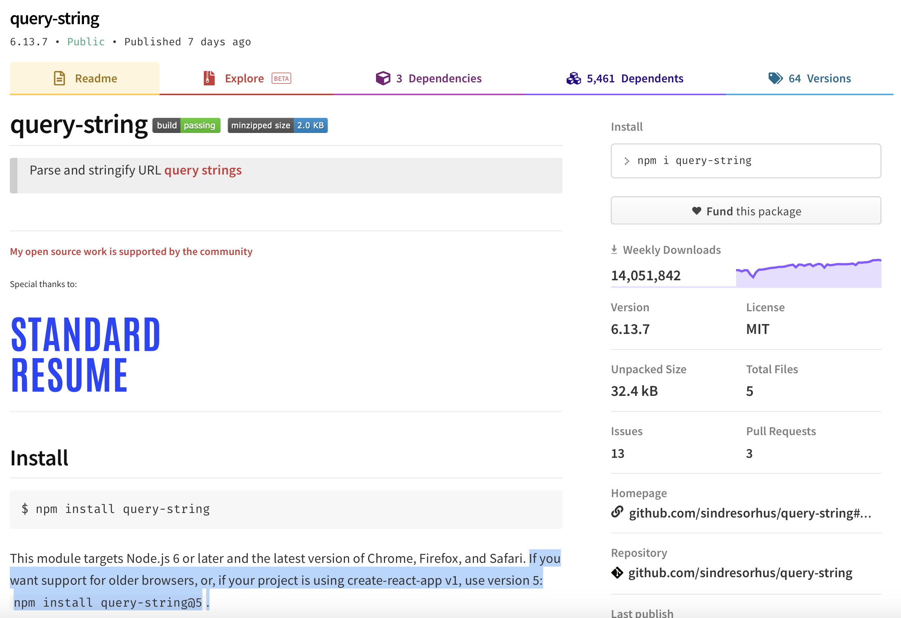

## 에러 만남

에러 메시지와 함께 화면을 아예 그리질 않음.

링크를 클릭해보면

## 분노

주어진 위 힌트로 어떻게 원인을 찾아가야할까요..

## 문제 찾는 방법

위와 같이 에러 메시지가 부실한 경우, 원인을 찾아가는 좋은 방법을 아시는 분은 댓글 부탁드립니다.
저는 방법을 모르겠어서 무식한 방법을 택했습니다..

### 의심 가는 용의자 추리기

- 다른 브라우저에서는 문제가 발생하지 않는데, 구브라우저에서만 발생한다. 폴리필 이슈?
- 나는 vue-cli를 사용하기 때문에, 내 코드는 ~~이론적으로~~ 폴리필 이슈가 없다.
- 외부 라이브러리 의심.

### 문제 찾기

외부 라이브러리 다 제거하고 실행해보니 정상 동작.
그리고 하나씩 추가하면서 어디서 문제가 생기는지 무식하게 확인했습니다..

범인은 query-string이었습니다.

## 해결

[query-string 공홈](https://www.npmjs.com/package/query-string) 방문.

제일 위에 구브라우저 사용법이 친절히 쓰여 있었네요...

## 교훈

1. 간단한 거는 그냥 만들어 쓰자. (외부 영향 최소화)
1. 외부 라이브러리 쓸 경우에는 리드미를 똑바로 읽자..
1. 이왕이면 검증 된 라이브러리를 쓰자. 
    - 검증의 기준은? 마땅한 기준은 없으나, 깃헙 star 개수로 짐작 가능..
